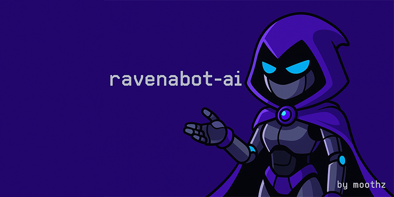

# RavenaBot AI



> Novo código da ravena completamente desenvolvido utilizando LLM Claude 3.7 Sonnet. Esta versão apresenta uma arquitetura modular, suporte a múltiplas instâncias, comandos personalizáveis e integração com plataformas de streaming. Livre para uso, sem garantias. Consulte o arquivo "Prompts" para ver as coisas que eu pedi pro Claude. Leia mais sobre os [design patterns aqui](docs/DesignPatterns.md).

## ℹ️ Principais diferenças

*No dia a dia:*
- Os comandos de gerencia foram trocados por !g-xxx, envie !cmd-g para conhecê-los!
- Todos os comandos precisam de prefixo agora, então quando criar um comando, não coloque o "!" na frente do nome do comando
- O prefixo dos comandos pode ser alterado usando !g-setPrefixo
- O !stt, que transformar áudio em texto, agora roda local e não precisa mais de chave azure nenhuma
- Agora dá pra adicionar quantos canais de twitch, kick e youtube quiser em um grupo
 

*Novos comandos legais*
- Pastas: É o _drive da ravena_! Guarde seus arquivos aqui e use comandos pra baixar todos de uma vez. Útil para grupos que precisam toda hora enviar documentos e outras coisas para membros novos.
- TTS com voz personalizada: Agora sintetizo as vozes local usando o AllSpeak, sendo o default a voz da ravena, mas podendo aprender a voz de outras pessoas também

*De código:*
- O código está liberado e qualquer um pode contribuir pra novas funçoes
- Foi 90% escrito por inteligência artificial _(Claude Sonnet 3.7)_
- A base de dados é compartilhada entre todas as ravenas agora
- Todas as ravenas rodam no mesmo processo

## 🔮 Visão Geral

RavenaBot é um bot avançado para WhatsApp usado em grupos. Oferece:

- **Sistema modular de comandos** - comandos fixos, personalizáveis, e de gerenciamento
- **Multiplas instâncias** - múltiplos números de WhatsApp podem ser executados no mesmo processo e compartilham a base de dados
- **Integração com streaming** - monitoramento de Twitch, Kick e YouTube com notificações customizáveis
- **Interação com LLM** - suporte a ChatGPT, Claude e outros modelos de linguagem
- **Detecção de NSFW** - filtragem de conteúdo impróprio
- **Sistema de convites** - gerenciamento avançado de convites de grupo
- **Personalização profunda** - comandos, filtros, reações e muito mais

Os usuários podem usar os comandos existentes ou criar seus próprios comandos personalizados para estender as funcionalidades do WhatsApp.

## 🚀 Recursos Principais

- **Comandos Fixos**: Comandos pré-definidos com funcionalidades prontas
- **Comandos Personalizáveis**: Crie comandos específicos para seu grupo
- **Monitoramento de Streams**: Receba notificações quando streamers ficarem online/offline
- **Integração com LLM**: Responda menções usando modelos de linguagem
- **Sistema de Filtros**: Filtre mensagens por palavras, links ou conteúdo NSFW
- **Manipulação de Mídia**: Stickers, conversões de arquivos e mais
- **Gerenciamento de Grupos**: Ferramentas para administradores
- **Sistema de Convites**: Controle quem pode adicionar o bot a grupos
- **Interações Automáticas**: O bot pode interagir aleatoriamente com mensagens
- **Notificações Personalizáveis**: Customize mensagens de boas-vindas e despedida

## ✅ TODO-Core

- [x] Estrutura base do bot
- [x] Sistema de comandos (fixos, personalizados, gerenciamento)
- [x] Gerenciamento de grupos
- [x] Variáveis personalizadas em respostas
- [x] Integração com LLM (OpenRouter, LM Studio)
- [x] Monitoramento de streams (Twitch, Kick, YouTube)
- [x] Sistema de convites
- [x] Detecção de conteúdo NSFW
- [x] Manipulação de mídia
- [x] Sistema de doações pelo tipa.ai
- [x] Servidor API
- [x] Instruções do VOSK para speech-to-text
- [X] Implementar docs para todas as funções implementadas até o momento
- [X] Implementar e testar comandos com variáveis para APIs personalizadas (RAB, LoL, WR, valorant, etc.)
- [X] Organizar/traduzir docs das funções
- [X] Mensagem IA pra join/leave de grupo
- [X] Comandos genéricos: Variáveis dinâmicas
    - [x] Implementar comando !g- pra mostrar todas
- [X] Comandos genéricos: processCustomStaticVariables implementar seleção random
- [X] Dados de quem enviou convite na mensagem quando add ravena
- [X] Additonal Admins: Bot considera outras pessoas como admin (a que add no grupo ou outra manual)
- [x] Editar README com principais diferenças da ravena antiga
- [x] Comando: !lembrar e versão nova com opção de repetir
- [x] Comando: !gif, busca de gifs
- [x] Comando: !imagine, geração de imagens no sdwebui
- [x] Comando: !anime, info de animes
    - [x] Traduzir sinopse
- [x] Comando: !imdb, info de filmes e séries
    - [x] Traduzir sinopse
- [x] Comando: !wiki, busca na wikipédia
- [x] Comando: !velharia, importa os comandos genéricos antigos da ravena
- [x] Comando: !dxx, comandos de dados agora como fixos
- [x] Comando: !apagar, pra apagar msgs do bot
- [x] Comando: !g-pausar, suspende atividade do bot no grupo
- [x] Comando: !traduzir + reações de bandeira
- [x] Comando: !lastfm
- [x] Comando: !news, ViniMunews (antigo JrMunews)
- [x] Comando: !live, pega info da streams do grupo
- [x] Comando: !streamers, mostra todas as lives monitoradas pelo bot (online)
- [x] Comando: !placa (apenas alguns grupos, serviço pago)
- [X] Implementar classes ReturnMessage e Command
- [x] Migrar as funções para utlizar as classes Command e ReturnMessage
- [x] Comandos de superadmin (!sa-join, !sa-block, refletir no model command.js)
- [x] Implementar isAdmin/AdditionalAdmin/SuperAdmin
- [x] Status do bot no status do whats
- [x] Quando o bot carregar, pegar contatos bloqueados e ignorar os mesmos em grupos
- [x] Interagir automatico em grupo com chance setada
- [x] Mensagem boas vindas fixa (data/groupJoin.txt)
- [x] Ranking mensagens (!faladores)
- [x] Comando: !apelido, remover do gerenciamento e processar no EventHandler
- [x] Comando: !g-manage dentro do grupo sem argumento
- [x] GroupJoin: Enviar o nome que ficou o grupo e como mudar
- [x] Variáveis: Mencionar pessoas {mention-55999999...}
- [x] Variáveis: Importar todas da ravena antiga
- [x] Melhorar comando !cmd pra ficar mais organizado
- [x] COOLDOWN DOS COMANDOS
- [x] Script para migração de dados da ravena antiga
    - [x] Grupos
    - [x] Lembretes
    - [x] Listas
    - [x] Outros
    - [x] News
    - [x] Midia da twitch
- [ ] Implementar !g-grupo-abrir e !g-grupo-fechar
- [ ] !live atualizar titulo do grupo
- [ ] Comando convite

## ✅ TODO-FIX
- [X] Fix respostas LLM não chegarem pelo OpenRouter
- [X] Fix boas vindas enviando mesmo sem setar
- [x] Fix emojis e reações que o claude criou estranhos
- [x] Fix autoStt não triggando
- [x] Imagine não tá retornando img
- [x] !gif tá retornando img estática
- [x] Fix TTS com AllTalk V2
- [x] Busca img não funciona
- [x] Não salvando algumas propriedades de grupo
- [x] Gerenciar no PV buga coisas normais
- [x] !g-manage está fazendo o bot responder dentro do grupo
- [x] Mention bot apenas no começo
- [x] Streams midia está substituindo e não adicionando
- [x] Quando der 404 na busca de canal  youtube, tirar da lista de monitorados e avisar no grupo
- [x] Algumas reações do AFTER não vão (ex.: !s)
- [x] !live tá enviando pra ele mesmo as msgs
- [x] Usar faster-whisper-xll
- [x] AllTalk pegar arquivos via API
- [ ] Bot tentando notificar sem estar nos grupos
- [ ] !le mais de 1 lista
- [ ] Stickers quadrados videos não envia (client.sendMessage)
- [x] Revisar cooldowns em todos comandos fixos
- [x] Cooldown por ravena e por grupo, não global entre as 3
- [x] Atualizar código para {mention} e {membroRandom}
- [x] Ignorar mensagens entre ravenas (grupos de adm)
- [x] Quando exceder requests do Gemini, tentar outro modelo ou local
- [ ] Fix Riot API


## ✅ TODO-Extras
- [ ] Gerar README.md atualizado
- [ ] Interface web para status dos bots
- [ ] Novo Jogo: Geoguesser
- [ ] Novo Jogo: Stop/Adedonha
- [ ] Novo Jogo: Anagrama
- [ ] Novo Jogo: Pesca
- [x] Emoji Kitchen
- [ ] Novo Comando: busca no youtube
- [ ] Downloader de SocialMedias (Insta, TikTok)
- [ ] Nova função Streams: Alterar imagem do grupo quando fica on/off
- [ ] Implementar ADB para digitar code de login automaticamente
- [ ] Melhor explicação da implementação do bot no README
- [ ] Interface web para administração
- [ ] Comando: !ajuda [topico], usar LLM pra gerar ajuda sobre os comandos
- [x] Simulador de mensagens do whats pra fazer tutoriais ([aqui](simulador/index.html))
    - [ ] Gerador de código de mockup para os tutoriais
    - [ ] Tutoriais

## 🔧 Instalação

### Pré-requisitos

* [Node.js](https://nodejs.org/) (v14.0.0 ou superior)
* [npm](https://www.npmjs.com/) (normalmente instalado com Node.js)
* [Python 3.7+](https://www.python.org/downloads/) (para funcionalidades de IA e processamento de imagem)
* [ImageMagick](docs/ImageManipulation.md) (para manipulação de imagens)
* [FFmpeg](https://ffmpeg.org/download.html) (para processamento de áudio e vídeo)

### Passo a passo

1. Clone o repositório:
   ```bash
   git clone https://github.com/seu-usuario/ravenabot-ai.git
   cd ravenabot-ai
   ```

2. Instale as dependências:
   ```bash
   npm install
   python -m pip install rembg[cli]
   ```

3. Copie o arquivo `.env.example` para `.env`:
   ```bash
   cp .env.example .env
   ```

4. Configure o arquivo `.env` (veja a seção [Configuração](#-configuração))

5. Inicie o bot:
   ```bash
   npm start
   ```

6. Escaneie o código QR que aparecerá no console usando o WhatsApp no seu celular.

## ⚙️ Configuração

Edite o arquivo `.env` com suas configurações. Abaixo estão as variáveis mais importantes:

```env
# Configuração do bot
DEFAULT_PREFIX=!        # Prefixo padrão para comandos
SAFE_MODE=false         # Modo seguro (não envia mensagens reais)
DEBUG=true              # Modo de depuração
HEADLESS_MODE=true      # Modo headless do navegador
YOUTUBE_DL_FOLDER=D:/youtube

# Configuração da API
API_PORT=5000           # Porta para o servidor da API
TIPA_TOKEN=seu_token    # Token webhook do Tipa.ai

# Chaves de API
OPENAI_API_KEY=         # Chave da API OpenAI (opcional)
OPENROUTER_API_KEY=     # Chave da API OpenRouter (recomendado)
LOCAL_LLM_ENDPOINT=     # Endpoint LLM local (ex: http://localhost:1234/v1)
OPENWEATHER_API_KEY=    # Chave da API OpenWeather (opcional)
SDWEBUI_URL=            # URL da API Stable Diffusion Web UI
OMDB_API_KEY=           # Chave da API do OMDB (para comandos IMDB)
GIPHY_API_KEY=          # Chave da API do Giphy

# Configurações de doação
DONATION_LINK=          # Link para doações tipa.ai
DONATION_GOAL_AMOUNT=   # Meta de doação
DONATION_GOAL_DESC=     # Descrição da meta

# IDs dos grupos de comunidade, formato 1234567890@g.us
GRUPO_LOGS=             # ID do grupo para logs
GRUPO_INVITES=          # ID do grupo para convites
GRUPO_AVISOS=           # ID do grupo para avisos
GRUPO_INTERACAO=        # ID do grupo para interação

# Tokens Twitch (para monitoramento de streams)
TWITCH_CLIENT_ID=       # Client ID da Twitch
TWITCH_CLIENT_SECRET=   # Client Secret da Twitch
```

### Programas Externos

O bot utiliza alguns programas externos para funcionalidades avançadas:

* [ImageMagick](docs/ImageManipulation.md) - Para manipulação de imagens
* [FFmpeg](https://ffmpeg.org/download.html) - Para processamento de áudio e vídeo
* [AllTalk V2](https://github.com/erew123/alltalk_tts/tree/alltalkbeta) - Para síntese de voz (opcional)
* [Whisper](https://github.com/openai/whisper) - Para transcrição de áudios (opcional)
* [Stable Diffusion Web UI](https://github.com/AUTOMATIC1111/stable-diffusion-webui) - Para geração de imagens (opcional)

Configure os caminhos destes programas no arquivo `.env`:

```env
# Programas
FFMPEG_PATH=C:/path/to/ffmpeg/bin/ffmpeg.exe
CHROME_PATH=             # Caminho personalizado para o Chrome (opcional)
```

## 📋 Tipos de Comandos

O bot implementa quatro tipos de comandos:

### 1. Comandos Fixos

São comandos pré-definidos implementados em JavaScript na pasta `src/functions`. Exemplos:

- `!ping`: Verifica se o bot está online
- `!ai <pergunta>`: Faz uma pergunta ao LLM
- `!weather <local>`: Obtém previsão do tempo
- `!roll [lados]`: Joga um dado (padrão: 6 lados)
- `!help`: Mostra comandos disponíveis
- `!imagine <prompt>`: Gera imagens com Stable Diffusion
- `!gif <termo>`: Busca e envia GIFs do Giphy
- `!anime <nome>`: Busca informações sobre animes
- `!imdb <título>`: Busca informações sobre filmes/séries
- `!wiki <termo>`: Busca artigos na Wikipedia
- `!dXX`: Comandos de dados (d20, d6, etc.)
- `!lembrar <data/hora>`: Cria um lembrete
- `!apagar`: Apaga mensagens do bot quando respondido

### 2. Comandos Personalizados

São criados pelos usuários para cada grupo usando o comando de gerenciamento `!g-addCmd`:

```
!g-addCmd saudação
Olá a todos no grupo!
```

Após criar, o comando pode ser usado com: `!saudação`

Os comandos personalizados suportam:
- Texto simples
- Mídia (imagens, vídeos, áudio, etc.)
- Variáveis: `{pessoa}`, `{date}`, `{time}`, etc.
- Comportamentos especiais como reagir à mensagem

### 3. Comandos de Gerenciamento

Começam com `!g-` e são usados para configurar o bot e o grupo:

- `!g-setName <nome>`: Define o nome do grupo
- `!g-addCmd <gatilho>`: Adiciona comando personalizado (usado como resposta)
- `!g-delCmd <comando>`: Remove comando personalizado
- `!g-setCustomPrefix <prefixo>`: Altera o prefixo de comando (vazio = sem prefixo)
- `!g-setWelcome <mensagem>`: Define mensagem de boas-vindas
- `!g-setFarewell <mensagem>`: Define mensagem de despedida
- `!g-filtro-palavra <palavra>`: Adiciona/remove palavra do filtro
- `!g-filtro-links`: Ativa/desativa filtro de links
- `!g-filtro-nsfw`: Ativa/desativa filtro de conteúdo NSFW
- `!g-pausar`: Pausa/retoma todas as atividades do bot no grupo

### 4. Comandos de SuperAdmin

Começam com `!sa-` e são comandos com privilégios especiais que só podem ser executados pelo número principal administrador do bot ou por números definidos como SuperAdmin:

- `!sa-join <grupo>`: Faz o bot entrar em um grupo via link de convite
- `!sa-block <número>`: Bloqueia um número em todos os grupos
- `!sa-unblock <número>`: Desbloqueia um número previamente bloqueado
- `!sa-status`: Mostra informações de status sobre o bot
- `!sa-broadcast <mensagem>`: Envia uma mensagem para todos os grupos
- `!sa-restart`: Reinicia o bot
- `!sa-update`: Atualiza o código do bot a partir do repositório
- `!sa-eval <código>`: Executa código JavaScript (perigoso, apenas para debugging)

Estes comandos são de uso restrito e servem para funções administrativas globais, afetando o bot como um todo, ao contrário dos comandos de gerenciamento que atuam apenas no contexto de um grupo específico.


## 🧩 Criando Novos Comandos

Para adicionar um novo comando fixo, crie um arquivo `.js` na pasta `src/functions/`. Exemplo:

```javascript
const Logger = require('../utils/Logger');
const Command = require('../models/Command');
const ReturnMessage = require('../models/ReturnMessage');

const logger = new Logger('meus-comandos');


const commands = [
  new Command({
    name: 'exemplo',
    description: 'Um comando de exemplo',
    reactions: {
      before: "⏳",  // Emoji mostrado antes da execução
      after: "✅"    // Emoji mostrado após a execução
    },
    method: async (bot, message, args, group) => {
      const chatId = message.group || message.author;
      logger.debug(`Executando comando exemplo`);
      
      // Obtém o primeiro argumento ou usa um valor padrão
      const nome = args.length > 0 ? args[0] : "mundo";
      
      // Envia a resposta
      return new ReturnMessage({
        chatId: chatId,
        content: `Olá, ${nome}!`
      });
    }
  }),
  
  // Adicione mais comandos aqui
];

// Exporta os comandos
module.exports = { commands };
```

### Propriedades de Comando

| Propriedade | Tipo | Descrição |
|-------------|------|-----------|
| `name` | string | **Obrigatório**. Nome do comando (usado após o prefixo). |
| `description` | string | Descrição do comando, exibida em mensagens de ajuda. |
| `method` | function | **Obrigatório**. Função a ser executada. Recebe `(bot, message, args, group)`. |
| `needsMedia` | boolean | Se `true`, o comando requer mídia. |
| `needsQuotedMsg` | boolean | Se `true`, o comando requer mensagem citada. |
| `aliases` | array | Nomes alternativos para o comando. |
| `cooldown` | number | Tempo de espera (segundos) entre usos do comando. |
| `adminOnly` | boolean | Se `true`, apenas administradores podem usar. |
| `groupOnly` | boolean | Se `true`, o comando só pode ser usado em grupos. |
| `privateOnly` | boolean | Se `true`, o comando só pode ser usado em chats privados. |
| `enabled` | boolean | Se `false`, o comando está desativado. |
| `hidden` | boolean | Se `true`, o comando não é mostrado na ajuda. |

## 📊 Monitoramento de Streams

O bot pode monitorar canais do Twitch, Kick e YouTube e notificar os grupos quando eles ficam online/offline:

### Comandos Twitch

- `!g-twitch-canal <canal>`: Ativa/desativa monitoramento do canal
- `!g-twitch-midia-on <canal>`: Define notificação para quando o canal ficar online
- `!g-twitch-midia-off <canal>`: Define notificação para quando o canal ficar offline
- `!g-twitch-mudarTitulo <canal>`: Ativa/desativa alteração do título do grupo
- `!g-twitch-titulo-on <canal> <título>`: Define título personalizado para quando online
- `!g-twitch-usarIA <canal>`: Ativa/desativa geração de mensagens com IA

Comandos similares existem para Kick (`!g-kick-...`) e YouTube (`!g-youtube-...`).

## 📚 Documentação dos Comandos

Esta seção contém documentação detalhada de cada categoria de comandos disponíveis atualmente no bot, explicando sua implementação, uso e requisitos.

- [Comandos de Anime](docs/AnimeCommands.md) - Busca informações sobre animes no MyAnimeList
- [Comandos de Dados (Dice)](docs/DiceCommands.md) - Sistema de dados para RPG e jogos
- [Comandos de Clima](docs/WeatherCommands.md) - Previsão do tempo e condições meteorológicas
- [Comandos de Conversão de Arquivos](docs/FileConversions.md) - Ferramentas para manipulação de áudio e mídia
- [Comandos de Fala e Voz](docs/SpeechCommands.md) - Conversão de texto para voz (TTS) e voz para texto (STT)
- [Comandos de Gestão de Arquivos](docs/FileCommands.md) - Sistema de armazenamento e compartilhamento de arquivos
- [Comandos de Grupo](docs/GroupCommands.md) - Gerenciamento e interação com grupos do WhatsApp
- [Comandos de IA](docs/IACommands.md) - Inteligência artificial, geração de texto e imagens
- [Comandos de Listas](docs/ListCommands.md) - Criação e gerenciamento de listas de participantes
- [Comandos de Monitoramento de Streams](docs/StreamCommands.md) - Monitoramento de Twitch, Kick e YouTube
- [Comandos de Busca](docs/SearchCommands.md) - Ferramentas para realizar buscas na web e imagens
- [Comandos de Stickers](docs/Stickers.md) - Criação e manipulação de stickers para WhatsApp
- [Comandos de Tradução](docs/TranslationCommands.md) - Tradução de texto entre diversos idiomas
- [Comandos do Wikipedia](docs/WikipediaCommands.md) - Busca de informações na enciclopédia online
- [Comandos do YouTube](docs/YoutubeDownloader.md) - Download de vídeos e áudios do YouTube
- [Comandos de Arquivos](docs/FileManager.md) - Gerenciamento e compartilhamento de arquivos entre usuários
- [Comandos Gerais](docs/GeneralCommands.md) - Comandos básicos e de utilidade geral
- [Comandos de GIFs](docs/GiphyCommands.md) - Busca e envio de GIFs animados
- [Comandos de Filmes e Séries](docs/ImdbCommands.md) - Busca de informações de filmes e séries
- [Comandos do Last.FM](docs/LastFMCommands.md) - Estatísticas e informações musicais do Last.FM
- [Comandos de Lembretes](docs/LembreteCommands.md) - Sistema de lembretes programados
- [Comandos de Ranking](docs/RankingMessages.md) - Estatísticas de participação no grupo
- [Comandos de Jogos Riot](docs/RiotGames.md) - Informações sobre jogadores de LoL, Wild Rift e Valorant
- [Comandos de Roleta Russa](docs/RoletaRussaCommands.md) - Jogo de roleta russa com timeout
- [Comandos de Clima](docs/Weather.md) - Informações meteorológicas e previsões do tempo
- [Comandos do YouTube](docs/YoutubeDownloader.md) - Download de vídeos e áudios do YouTube

Para informações detalhadas sobre a configuração de comandos de gerenciamento (que começam com !g-), consulte a [Documentação de Gerenciamento](docs/Management.md).

## 📝 Licença

Free, usem como quiserem.