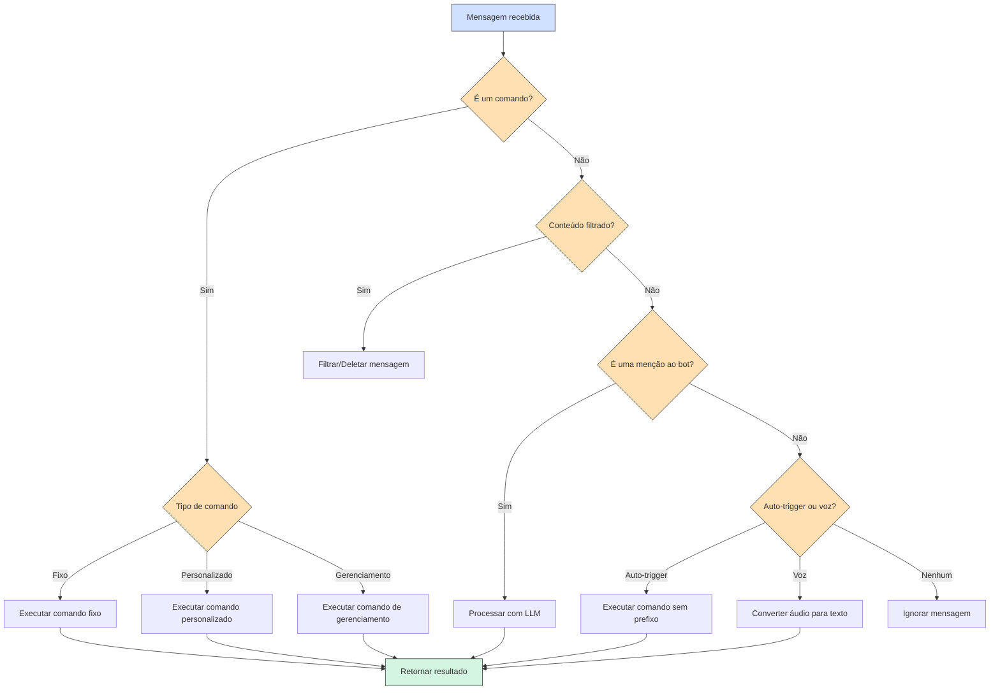

# ravenabot-ai


> Novo código da ravena completamente desenvolvido utilizando LLM Claude 3.7 Sonnet. Esta versão apresenta uma arquitetura modular, suporte a múltiplas instâncias, comandos personalizáveis e integração com plataformas de streaming. Livre para uso, sem garantias. Consulte o arquivo "Prompts" para ver as coisas que eu pedi pro Claude.

## ℹ️ Principais diferenças
- Comandos de gerenciar agora são !g-
- Por padrão, agora precisam do prefixo para serem acionados. É possível mudar usando !g-setCustomPrefix. A ravena antiga não tinha prefixo
- Todos números rodam no mesmo processo e compartilham a base de dados


## ✅ TODO-List

- [x] Estrutura base do bot
- [x] Sistema de comandos (fixos, personalizados, gerenciamento)
- [x] Gerenciamento de grupos
- [x] Variáveis personalizadas em respostas
- [x] Integração com LLM (OpenRouter, LM Studio)
- [x] Monitoramento de streams (Twitch, Kick, YouTube)
- [x] Sistema de convites
- [x] Detecção de conteúdo NSFW
- [x] Manipulação de mídia
- [x] Sistema de doações pelo tipa.ai
- [x] Servidor API
- [ ] Editar README com principais diferenças da ravena antiga
- [ ] Melhorar comando !cmd pra ficar mais organizado
- [ ] Implementar e testar comandos com variáveis para APIs personalizadas
- [ ] Organizar/traduzir docs das funções
- [ ] Ferramentas de análise e estatísticas
- [ ] Mensagem IA pra join/leave de grupo
- [ ] Dados de quem enviou convite na mensagem quando add ravena
- [ ] Novo Jogo: Geoguesser
- [ ] Novo Jogo: Stop/Adedonha
- [ ] Interface web para status dos bots
- [ ] Interface web para administração
- [ ] Pensar em novos jogos

## ✅ TODO-FIX-List
- [ ] Fix respostas LLM não chegarem pelo OpenRouter
- [ ] Fix boas vindas enviando mesmo sem setar

## 🔧 Instalação

### Pré-requisitos

* [Node.js](https://nodejs.org/) (v14.0.0 ou superior)
* [npm](https://www.npmjs.com/) (normalmente instalado com Node.js)
* [Python 3.7+](https://www.python.org/downloads/) (para funcionalidades de IA e processamento de imagem)
* [ImageMagick](docs/ImageManipulation.md) (para manipulação de imagens)
* [FFmpeg](https://ffmpeg.org/download.html) (para processamento de áudio e vídeo)

### Passo a passo

1. Clone o repositório:
   ```bash
   git clone https://github.com/seu-usuario/ravenabot-ai.git
   cd ravenabot-ai
   ```

2. Instale as dependências:
   ```bash
   npm install
   ```

   Este comando também instalará automaticamente as dependências Python necessárias.

3. Copie o arquivo `.env.example` para `.env`:
   ```bash
   cp .env.example .env
   ```

4. Configure o arquivo `.env` (veja a seção [Configuração](#-configuração))

5. Inicie o bot:
   ```bash
   npm start
   ```

6. Escaneie o código QR que aparecerá no console usando o WhatsApp no seu celular.

## ⚙️ Configuração

Edite o arquivo `.env` com suas configurações. Abaixo estão as variáveis mais importantes:

```env
# Configuração do bot
DEFAULT_PREFIX=!        # Prefixo padrão para comandos
SAFE_MODE=false         # Modo seguro (não envia mensagens reais)
DEBUG=true              # Modo de depuração
HEADLESS_MODE=true      # Modo headless do navegador

# Configuração da API
API_PORT=5000           # Porta para o servidor da API
TIPA_TOKEN=seu_token    # Token webhook do Tipa.ai

# Chaves de API
OPENAI_API_KEY=         # Chave da API OpenAI (opcional)
OPENROUTER_API_KEY=     # Chave da API OpenRouter (recomendado)
LOCAL_LLM_ENDPOINT=     # Endpoint LLM local (ex: http://localhost:1234/v1)
OPENWEATHER_API_KEY=    # Chave da API OpenWeather (opcional)

# Configurações de doação
DONATION_LINK=          # Link para doações tipa.ai
DONATION_GOAL_AMOUNT=   # Meta de doação
DONATION_GOAL_DESC=     # Descrição da meta

# IDs dos grupos de comunidade, formato 1234567890@g.us
GRUPO_LOGS=             # ID do grupo para logs
GRUPO_INVITES=          # ID do grupo para convites
GRUPO_AVISOS=           # ID do grupo para avisos
GRUPO_INTERACAO=        # ID do grupo para interação

# Tokens Twitch (para monitoramento de streams)
TWITCH_CLIENT_ID=       # Client ID da Twitch
TWITCH_CLIENT_SECRET=   # Client Secret da Twitch
```

### Programas Externos

O bot utiliza alguns programas externos para funcionalidades avançadas:

* [ImageMagick](docs/ImageManipulation.md) - Para manipulação de imagens
* [FFmpeg](https://ffmpeg.org/download.html) - Para processamento de áudio e vídeo
* [eSpeak](http://espeak.sourceforge.net/) - Para síntese de voz (opcional)

Configure os caminhos destes programas no arquivo `.env`:

```env
# Programas
ESPEAK_PATH=C:/path/to/espeak/espeak.exe
FFMPEG_PATH=C:/path/to/ffmpeg/bin/ffmpeg.exe
CHROME_PATH=             # Caminho personalizado para o Chrome (opcional)
```

## 🔄 Fluxo de Funcionamento



## 📋 Tipos de Comandos

O bot suporta três tipos de comandos:

### 1. Comandos Fixos

São comandos pré-definidos implementados em JavaScript na pasta `src/functions`. Exemplos:

- `!ping`: Verifica se o bot está online
- `!ai <pergunta>`: Faz uma pergunta ao LLM
- `!weather <local>`: Obtém previsão do tempo
- `!roll [lados]`: Joga um dado (padrão: 6 lados)
- `!help`: Mostra comandos disponíveis

### 2. Comandos Personalizados

São criados pelos usuários para cada grupo usando o comando de gerenciamento `!g-addCmd`:

```
!g-addCmd saudação
Olá a todos no grupo!
```

Após criar, o comando pode ser usado com: `!saudação`

Os comandos personalizados suportam:
- Texto simples
- Mídia (imagens, vídeos, áudio, etc.)
- Variáveis: `{pessoa}`, `{date}`, `{time}`, etc.
- Comportamentos especiais como reagir à mensagem

### 3. Comandos de Gerenciamento

Começam com `!g-` e são usados para configurar o bot e o grupo:

- `!g-setName <nome>`: Define o nome do grupo
- `!g-addCmd <gatilho>`: Adiciona comando personalizado (usado como resposta)
- `!g-delCmd <comando>`: Remove comando personalizado
- `!g-setCustomPrefix <prefixo>`: Altera o prefixo de comando (vazio = sem prefixo)
- `!g-setWelcome <mensagem>`: Define mensagem de boas-vindas
- `!g-setFarewell <mensagem>`: Define mensagem de despedida
- `!g-filtro-palavra <palavra>`: Adiciona/remove palavra do filtro
- `!g-filtro-links`: Ativa/desativa filtro de links
- `!g-filtro-nsfw`: Ativa/desativa filtro de conteúdo NSFW

## 🧩 Criando Novos Comandos

Para adicionar um novo comando fixo, crie um arquivo `.js` na pasta `src/functions/`. Exemplo:

```javascript
const Logger = require('../utils/Logger');
const logger = new Logger('meus-comandos');

const commands = [
  {
    name: 'exemplo',
    description: 'Um comando de exemplo',
    reactions: {
      before: "⏳",  // Emoji mostrado antes da execução
      after: "✅"    // Emoji mostrado após a execução
    },
    method: async (bot, message, args, group) => {
      const chatId = message.group || message.author;
      logger.debug(`Executando comando exemplo`);
      
      // Obtém o primeiro argumento ou usa um valor padrão
      const nome = args.length > 0 ? args[0] : "mundo";
      
      // Envia a resposta
      await bot.sendMessage(chatId, `Olá, ${nome}!`);
    }
  },
  
  // Adicione mais comandos aqui
];

// Exporta os comandos
module.exports = { commands };
```

### Propriedades de Comando

| Propriedade | Tipo | Descrição |
|-------------|------|-----------|
| `name` | string | **Obrigatório**. Nome do comando (usado após o prefixo). |
| `description` | string | Descrição do comando, exibida em mensagens de ajuda. |
| `method` | function | **Obrigatório**. Função a ser executada. Recebe `(bot, message, args, group)`. |
| `needsMedia` | boolean | Se `true`, o comando requer mídia. |
| `needsQuotedMsg` | boolean | Se `true`, o comando requer mensagem citada. |
| `aliases` | array | Nomes alternativos para o comando. |
| `cooldown` | number | Tempo de espera (segundos) entre usos do comando. |
| `adminOnly` | boolean | Se `true`, apenas administradores podem usar. |
| `groupOnly` | boolean | Se `true`, o comando só pode ser usado em grupos. |
| `privateOnly` | boolean | Se `true`, o comando só pode ser usado em chats privados. |
| `enabled` | boolean | Se `false`, o comando está desativado. |
| `hidden` | boolean | Se `true`, o comando não é mostrado na ajuda. |

## 📊 Monitoramento de Streams

O bot pode monitorar canais do Twitch, Kick e YouTube e notificar os grupos quando eles ficam online/offline:

### Comandos Twitch

- `!g-twitch-canal <canal>`: Ativa/desativa monitoramento do canal
- `!g-twitch-midia-on <canal>`: Define notificação para quando o canal ficar online
- `!g-twitch-midia-off <canal>`: Define notificação para quando o canal ficar offline
- `!g-twitch-mudarTitulo <canal>`: Ativa/desativa alteração do título do grupo
- `!g-twitch-titulo-on <canal> <título>`: Define título personalizado para quando online
- `!g-twitch-usarIA <canal>`: Ativa/desativa geração de mensagens com IA

Comandos similares existem para Kick (`!g-kick-...`) e YouTube (`!g-youtube-...`).

## 📝 Licença

Free, usem como quiserem.